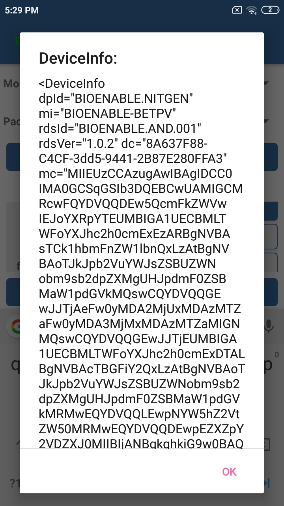
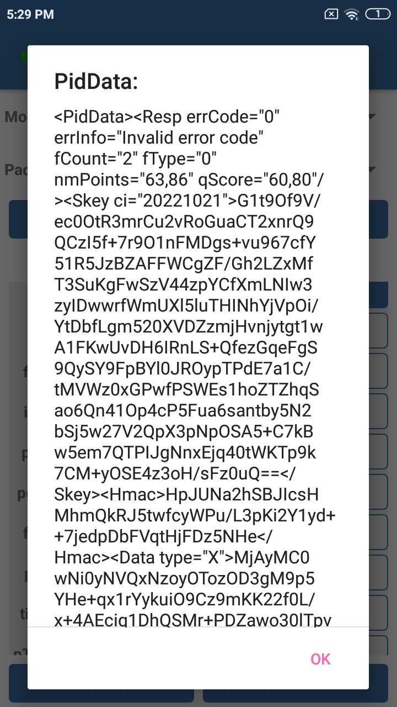
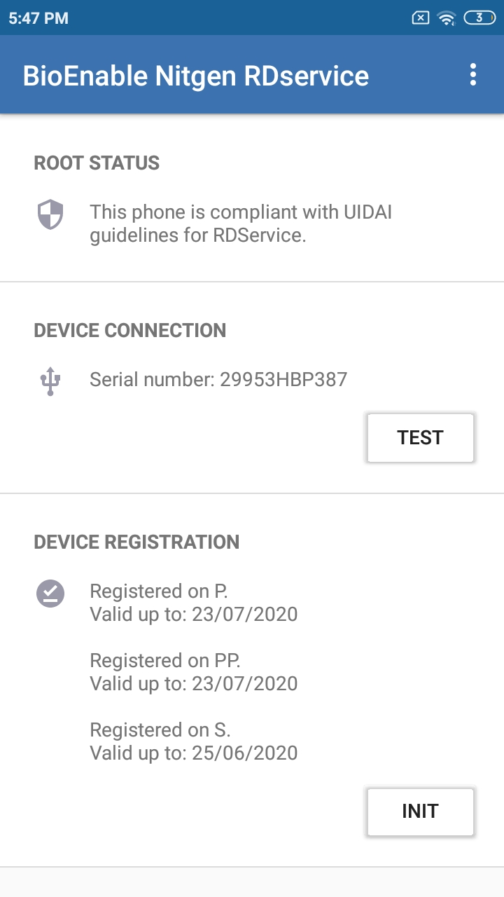
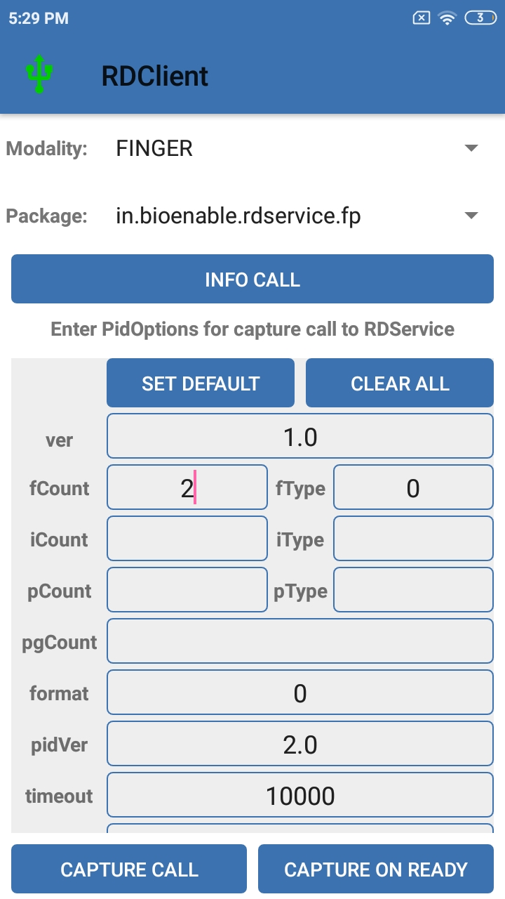

# RD Service 

Registered devices addresses the solution to eliminate the use of stored biometrics. It provides three key additional features compared to public devices:
1. Device identification – every device having a unique identifier allowing traceability, analytics, and fraud management.
2. Eliminating use of stored biometrics – biometric data is signed within the device using the provider key to ensure it is indeed captured live. Then the Registered Device (RD) Service of the device provider must form the encrypted PID block before returning to the host application.
3. A standardized RD Service provided by the device providers that is certified.-This RD Service (exposed via Service interface defined in this spec) encapsulates the biometric capture, any user experience while capturing (such as preview), and signing and encryption of biometrics all within it.

## Process of RDService (rds_fp_enhanced_api)

### Client app integration
On Android platform, client apps integrates with the RDService by using intents. There are two types of calls that client apps make to RDService:
- Info call. 
- Capture call.

The documentation for the client integration can be found [here](https://docs.google.com/document/d/11nFgA6SPxHC5P1PjdzIElMnPfbsVvMItPfHUulFvWQk/edit?usp=sharing).

### Device registration
- Before proceeding to the device registration process, it's ensured that the phone running the RDService is [SafetyNet](https://developer.android.com/training/safetynet/attestation) compliant (not rooted). For running the SafetyNet check, the method `checkForRoot()` of [RootChecker.java](https://github.com/mkn-bioenable/rds_fp_enhanced_api/blob/rds_fp_enhanced_api/app/src/main/java/in/bioenable/rdservice/fp/helper/RootChecker.java) class is called. On successfully completing the SafetyNet verification, the device can be accessed by the RDService.

- As the device is connected to the phone which is running RDService, app automatically detects the Nitgen devices and opens the device connection. This requires the USB device permission. If this permission was not already available, app asks for USB permission and on allowing, it opens the USB device connection using `open()` function available in [NitgenScanner.kt](https://github.com/mkn-bioenable/rds_fp_enhanced_api/blob/rds_fp_enhanced_api/app/src/main/java/in/bioenable/rdservice/fp/service/NitgenScanner.kt) class.

- Once the device is opened, RDService reads the serial number of device using `readSerial()` function available in [NitgenScanner.kt](https://github.com/mkn-bioenable/rds_fp_enhanced_api/blob/rds_fp_enhanced_api/app/src/main/java/in/bioenable/rdservice/fp/service/NitgenScanner.kt) class.

- After reading the serial number, RDService checks in the shared preferences if this serial number is already registered by checking the dc and mc values. If mc and dc values are not found in shared preferences, RDService enables "INIT" button on gui for registering the serial number.

- Clicking the "INIT" button calls the `api.registerDevice()` method of [WebServiceImpl.kt](https://github.com/mkn-bioenable/rds_fp_enhanced_api/blob/rds_fp_enhanced_api/app/src/main/java/in/bioenable/rdservice/fp/network/WebServiceImpl.kt) class. `api.registerDevice()` method requires the serial number and device public key essentially. Serial is obtained as described above and the device public key is generated using the `create()` method of [KeysCreator.java](https://github.com/mkn-bioenable/rds_fp_enhanced_api/blob/rds_fp_enhanced_api/app/src/main/java/in/bioenable/rdservice/fp/helper/KeysCreator.java) class.

- On successful registration of device, `mc` and `dc` values are obtained in the response which are stored in shared preference. This completes the registration process and app now shows device is registered.

- The request and response bodies of the register device api call are encrypted using the `encryptAES256()` method and decrypted using `decryptAES256()` method of [CryptoUtil.java](https://github.com/mkn-bioenable/rds_fp_enhanced_api/blob/rds_fp_enhanced_api/app/src/main/java/in/bioenable/rdservice/fp/helper/CryptoUtil.java) class for the secure communication between RDService app and management server.

- After device is registered, RDService is ready to handle the INFO and CAPTURE calls without giving any error codes in response XMLs.

### 1. Info Call:
Client applications give an Info call to RDService to get the current status of RDService whether it's ready or not for handling the capture requests for capturing resident fingerprints. In response, RDService returns a DeviceInfo XML describing the current status. The structure of DeviceInfo xml and description about tags and attributes can be found in [Aadhaar Registered Devices document](https://drive.google.com/file/d/1kG2zXRzvnCIHzJoBHtlqHVZue4O8_c-S/view?usp=sharing).

### 2. Capture call
For capturing fingerprints, client apps give capture call to RDService. For telling about the required captured data, capture timeout etc, client apps send a PidOptions XML to the RDService along with the capture intent. In response to the capture call, RDService gives a PidData XML. The structure of PidOptions and PidData XMLs can be found in [Aadhaar Registered Devices document](https://drive.google.com/file/d/1kG2zXRzvnCIHzJoBHtlqHVZue4O8_c-S/view?usp=sharing).

- When a client app gives capture call to RDService, first RDService validates the PidOptions came into capture intent using the `getPidOptionsErrorCode()` method of [ErrorCode.java](https://github.com/mkn-bioenable/rds_fp_enhanced_api/blob/rds_fp_enhanced_api/app/src/main/java/in/bioenable/rdservice/fp/model/ErrorCode.java). This method returns 0 as error code if PidOptions are valid.

- When PidOptions are found valid, RDService captures the fingerprint in a loop depending upon the fCount in PidOptions i.e. if fCount = 2, it will capture the fingerprint twice in loop. It capture the fingerprint using the `capture()` method of [NitgenScanner.kt](https://github.com/mkn-bioenable/rds_fp_enhanced_api/blob/rds_fp_enhanced_api/app/src/main/java/in/bioenable/rdservice/fp/service/NitgenScanner.kt) class.

- On successfully capturing a fingerprint, a [Bio](https://github.com/mkn-bioenable/rds_fp_enhanced_api/blob/rds_fp_enhanced_api/app/src/main/java/in/bioenable/rdservice/fp/model/Bio.java) object containing the biometric data is prepared. This Bio object represents the <Bio/> tag present in Pid XML. The structure of Pid XML can be found in [Aaadhaar Authentication document](https://drive.google.com/file/d/16wAuccMxA-VYhxf3l-EETUOdHxya0ne1/view) here.

- Depending upon the fCount and fType, single or multiple fingerprints are captured and using the `createPidXML()` method of [XMLHelper.java](https://github.com/mkn-bioenable/rds_fp_enhanced_api/blob/rds_fp_enhanced_api/app/src/main/java/in/bioenable/rdservice/fp/helper/XMLHelper.java), a PID XML, containing all fingerprints data, is prepared.

- This Pid XML is then encrypted using `encryptAesGcm()` method of [CryptoUtil.java](https://github.com/mkn-bioenable/rds_fp_enhanced_api/blob/rds_fp_enhanced_api/app/src/main/java/in/bioenable/rdservice/fp/helper/CryptoUtil.java) class and <Data/> tag of PidData XML is prepared.

- Then the other tags <Hmac/>, <Skey/> etc of <PidData/> XML are sequencially prepared using `processAndSetPidData()` method of the same [CryptoUtil.java](https://github.com/mkn-bioenable/rds_fp_enhanced_api/blob/rds_fp_enhanced_api/app/src/main/java/in/bioenable/rdservice/fp/helper/CryptoUtil.java) class.

- The principle of creating PidData is also available [Aadhaar Registered Devices document](https://drive.google.com/file/d/1kG2zXRzvnCIHzJoBHtlqHVZue4O8_c-S/view?usp=sharing).

- This PidData XML is then returned as the response of capture call by the client app.

## Management Server API

rds_fp_enhanced_api (RDService) uses json api for communicating with management server for device registration. The documentation for the api is as below:

https://docs.google.com/document/d/1XlJA_rzrVHLf0AO43Bw3AtdPty7vLDqAVmKPZGtOq7s/edit

## PID options 

1. In PID options customers can set default values. If customers set default values then, mandatory fields will be filled automatically.
2. Mandatory fields are ver, fCount, fType, format, pidVer, timeout, posh. 
3. There are some fields are having limits. 
For e.g - fType should be only 0 or 1 etc.
4. According to fields some standard error codes also there.
For e.g - 100 “Invalid PidOptions input. XML should strictly adhere to spec.” (It will occur if there no data is present for finger, iris, or photo, etc.)  

## PID data 

1. PID data is generating after the response came. 
2. In PID there should be response and device info. 
3. In response, there should be errCode, errInfo, and PID options data.
4. In device info, there is device information which contains Sr.no. values, names, etc.

## Device Registration 

1. For registration firstly customers can check is this device is activated and rooted or not.
2. If it is activated then customers can move for device registration.
3. For authentication purposes, the server can authenticate the user by mobile number or email id.
4. For registration, customers have to send a public device key and the serial number of nitgen devices to the management server.
5. The management server can accept public device key and serial number and create dc and mc. 
6. In RDclient, the management server can send that dc and mc value as a response to the info call and capture call.  
5. Ultimately dc and mc are useful for client applications.

 
## RDClient

RDclient is an informative android application for clients.

By using the RDclient application customer can communicate with RD service.

Customers can send PID options and in response, customers can get PID data.

In this order, the RDclient application can work. 

